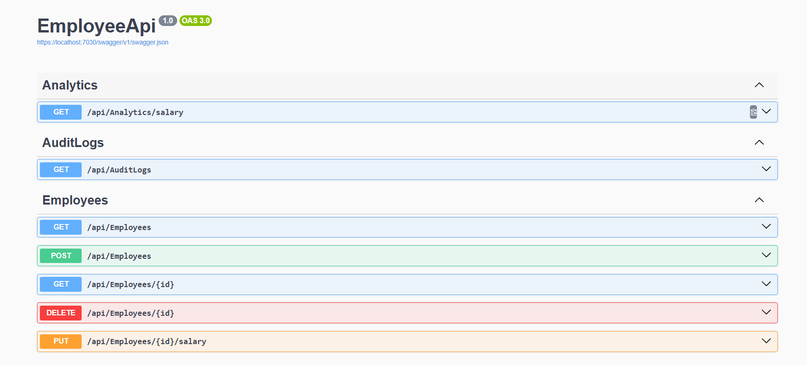

# 🏢 Employee Management API


Simple yet powerful Employee Management API built with **ASP.NET Core 8**. This project provides a robust backend for managing employee data, tracking salary changes, and maintaining audit logs for all operations.

---

## 📸 API Preview (Swagger)

<p align="center">
  
</p>


---

## 🛠 Tech Stack

- **Framework:** ASP.NET Core 8 (Web API)
- **Database:** SQLite
- **ORM:** Entity Framework Core
- **Documentation:** Swagger / OpenAPI
- **Logging:** Custom Audit Logging System

## 🚀 Key Features

- **Full CRUD Operations:** Seamlessly manage employees (Create, Read, Update, Delete).
- **Salary Analytics:** Built-in logic for analyzing employee compensation.
- **Audit Logging:** Every change is tracked, providing a history of modifications.
- **RESTful Design:** Clean and predictable API structure.

## 🏁 Getting Started

### Prerequisites
- [.NET 8 SDK](https://dotnet.microsoft.com/download/dotnet/8.0 )

### Installation & Run

1. **Clone the repository:**
   ```bash
   git clone https://github.com/Dzoni999/employee-management-api.git
